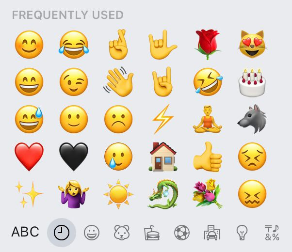
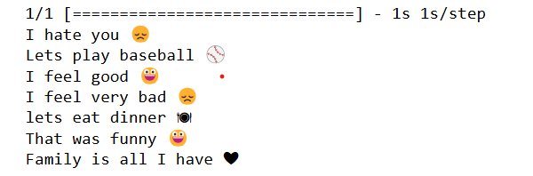

# Emoji Prediction Based on Text Sentiment
Emojis have become an essential part of communication, allowing individuals to express emotions and sentiments in a visual way. However, with the vast array of emojis available, it can be difficult to choose the right one for a given piece of text. This project addresses this challenge by predicting relevant emojis based on the sentiment of the input text.

## Project Overview
The goal of this project is to analyze a given sentence and predict the most appropriate emoji using deep learning models. By understanding the sentiment and context of the text, the model suggests an emoji that best represents the mood or emotion conveyed.

## Models Used
LSTM (Long Short-Term Memory): This model is used for text processing and emoji prediction. LSTM has been chosen due to its ability to handle long-range dependencies in text, making it suitable for understanding the sentiment conveyed in sentences.

## File Structure
Predicting-Emojis.ipynb: This Python script contains the code for the LSTM model and handles the training and prediction of emojis based on input text.
glove.6B.100d.txt: This file contains pre-trained word embeddings from GloVe, which are used to convert words into vector representations that the model can process. You can download it from [this link](https://www.kaggle.com/watts2/glove6b50dtxt).

## Results
The LSTM model successfully predicts emojis that match the sentiment of the given text. By leveraging the powerful capabilities of LSTM, the model can capture the context of the sentence, leading to more accurate emoji predictions.
   

